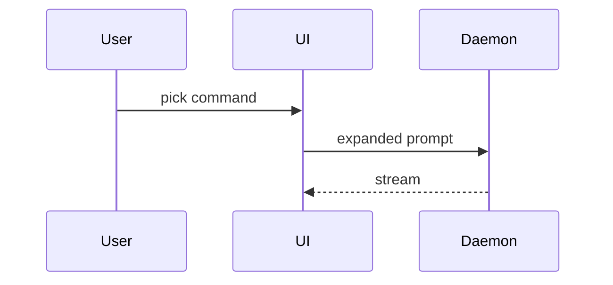

# Sightline

Plan only as far as you can see. Then go look further.

## Where this sits

This is not an interview skill. `/plan-with-docs` runs the interview in this
repo; sightline is the handler for the questions that interview cannot resolve.

- **Interview skills** (`/plan-with-docs` here) assume the answer is in the
  user's head and press until it comes out.
- **Mapping skills** assume the answer is a decision someone can make once the
  question is framed well enough.
- **Sightline** owns the third case: nobody knows yet, and no amount of framing
  or pressing will change that. The answer has to be built before it can be
  known.

Sightline is standalone, and runs across many contexts. The interview is one
session ending in a plan file, so it cannot host an effort that outlives its own
context. The seam:

```
one unknowable question   → /probe, inline, interview resumes on the 4-liner
the interview stalls      → stop it, run /sightline on that area, come back with
                            ADRs + glossary, which /plan-with-docs already loads
                            as constraints
fogged from the start     → /sightline is the front door, and usually the whole
                            journey. It ends by putting both exits to the user —
                            build it now, or /plan-with-docs — and they pick
```

So invoke it two ways: as the **front door** when the work is fogged from the
start — the common case — or as a **sidecar** when an interview stalls and hands
the whole area here.

The failure this exists to prevent: an interview designed to resolve every
branch of the design tree, meeting a branch that cannot be resolved by talking,
and extracting a guess anyway. The guess then reads exactly like a decision in
the resulting plan. Everything downstream inherits it, and nobody remembers it
was invented under pressure.

The second failure: a long, thorough plan the user approved without holding.
They then can't participate — can't spot the wrong turn, can't come up with the
next idea, because they lack the concepts to think with. Understanding is not
verification. Optimise for their ability to keep steering.

## What to read next

This file is the spine — invariants, disk layout, the turn loop, how to talk.
The procedures are loaded on demand, because a session works **one row** and
shouldn't be carrying the other five phases while it does.

| You are | Read |
|---|---|
| resuming — `.sight/` exists | `sight resume`, then [cookbooks/resolve-row.md](cookbooks/resolve-row.md) |
| starting fogged work, nothing on disk | [cookbooks/new-effort.md](cookbooks/new-effort.md) |
| holding a finding, or out of `now` rows | [cookbooks/land.md](cookbooks/land.md) — horizon check first, then the plan |
| looking at a board, the user drew one, or one is worth offering | [cookbooks/board.md](cookbooks/board.md) — before anything else |
| building, and an assumption just broke | [cookbooks/land.md](cookbooks/land.md) § re-fogging |

Read one. Needing two at once usually means the row is two rows.

### When to offer a board

The user will rarely ask. Offer at these moments — one line, then carry on in
text whether or not they take it:

| Moment | Why |
|---|---|
| a question is about **shape** — what talks to what, ordering, what crosses a boundary — and the text form needs more than ~6 nodes | `A --> B` stops being readable exactly when the arrows start crossing |
| they're answering a structural question and stall, or say "hard to explain" | drawing is faster than typing, for them |
| a probe changed the structure | show it as a diff on the board, not as a paragraph about the change |
| the horizon check is structural | the reconstruction they owe you can *be* the board |
| a new effort whose destination is a system, not a value | frames per horizon give the whole effort one picture |

Offer, never open. Never wait for them to look, never answer with "see the
board", and never let a board be the only place something is said. The board is
one board per effort — that *is* the general view, so there is no second one to
build.

If they take it, it is live from that moment: what they draw reaches you three
seconds after they stop, and what you add reaches their open tab. Still don't
wait on it — they may draw nothing, and the conversation carries on regardless.

## Commands

The skill picks recipes; it never improvises shell. Each is one node script —
`just` is convenience, not a dependency.

| `sight …` | falls back to | does |
|---|---|---|
| `resume [effort]` | `node scripts/resume.mjs` | the only thing a fresh context reads |
| `board <file>` | `node scripts/board-serve.mjs` | Excalidraw on localhost:3777, autosaving, two-way |
| `add '<json>'` | `node scripts/board-add.mjs --json` | append boxes/arrows/frames, bound correctly |
| `box` / `arrow` / `frame` | `node scripts/board-add.mjs …` | one element at a time |
| `ids` | `node scripts/board-add.mjs --list` | what's on the board, mine vs theirs |

```
alias sight='just --justfile <this skill>/justfile --working-directory .'
```

`board` is never run as a plain background command — always under `Monitor`,
`persistent: true`. Its stdout is a change feed, not a log: three seconds after
they stop drawing, one block arrives naming what changed. Serving a board
without watching it is the old one-way board, and wastes the thing they drew.

```
you  sight add …  ──→ file ──→ their open tab updates, mid-drag and all
they draw         ──→ file ──→ 3s quiet ──→ "board: 2 changes …" in your chat
```

When a block arrives, mid-row and unloaded cookbook notwithstanding:

| The drawing | You |
|---|---|
| contradicts the row you're on | say so in one line — it may end the probe early |
| contradicts a landed finding | reopen that row on the map |
| a `?`, or a scribble you can't read | onto the map, not into this turn |
| anything else | one line of ack |

Never answer a drawing with a redraw. Fuller mechanics:
[cookbooks/board.md](cookbooks/board.md).

## Invariants

1. **Don't ask the user something they can't know.** When an answer arrives with
   a shrug, a "probably", a restatement of your own suggestion, or an instant
   yes to your recommendation, stop collecting it. Re-put it as a scenario
   (below); if that still draws a shrug, it's a probe, not an answer — onto the
   map as one.
2. **Never plan past the horizon.** The horizon is the first point where
   building will teach you something that changes everything after it. Beyond
   it, write named unknowns, not steps.
3. **Probe code is throwaway and quarantined.** Never write production code
   during a sightline session. A probe answers a question and then dies.
4. **Every resolution produces something the user can disagree with.** A claim
   they can only nod at is not a resolution.
5. **The user's understanding is a gate.** If they can't explain a decision
   back, it isn't made yet, however good it is.
6. **The context window is not the store.** Anything that matters is on disk
   before the turn ends. Assume this session dies without warning.

## How to talk during a session

Terse. Show, don't describe. The user does not reason in prose, and a paragraph
explaining a shape is strictly worse than the shape.

| Instead of | Write |
|---|---|
| "the retry policy backs off exponentially" | `1s, 2s, 4s, 8s, give up` |
| a paragraph on the tradeoff | table, two columns, one row per option |
| "consider whether X should own Y" | the two type signatures, pick one |

### Pick the smallest view that carries the point

One form per point. Two if they carry different points. Never all of them.

**A rule, a policy, an algorithm** — pseudocode:

```text
on(save)
  content unchanged → return cached
  write, invalidate cache
```

**What calls what** — call tree:

```text
submitForm
  createSession
    persistPrompt
    launchAgent
  navigate
```

**UI shape** — component tree, carrying only the state and boundaries in
question:

```text
<SessionPage>            routes/session.tsx
  useSessionEvents()
  <Toolbar>
    <RunButton>          packages/ui
```

**Who owns what** — shallow file tree, one clause per dir:

```text
src/
├── commands/   parses user actions
├── sessions/   owns session state
└── transport/  talks to the API
```

**Ordering across processes** — mermaid, when the sequence *is* the point:



**A change to any of the above** — a diff *in that same form*, so the unchanged
lines carry the context:

```diff
 on(save)
-  write content
+  content unchanged → return cached
+  write, invalidate cache
```

This is the text twin of showing a probe's result as a board diff, and it is the
form most turns want: a probe rarely invents a shape, it moves one. Show the
whole block instead only when most of it is new, when the omitted context would
hide ownership or order, or when they need something copyable to write against.

Rules:
- Under ~60 words of prose per turn. Longer wants a view, not more sentences.
- Every claim about behaviour gets a concrete instance next to it.
- Each view sits next to the one or two lines it supports — never a wall of
  diagrams, never a diagram with no claim attached.
- Keep only the calls, files, props and boundaries the current question turns
  on. Everything else is noise you are asking them to filter.
- No preamble, no recap of what was just agreed.
- Too dense for text — a layout, a state comparison, a side-by-side of two
  designs — is one focused HTML file with the product's real labels and data,
  then `open` it. Not a second board: when a board is live, structure lives
  there.

Same for what you produce: findings, ADRs, plans, the plan's `## Decided` lines.
Short, exemplified, skimmable — the same forms, on disk.

## Working outside the context window

Fogged work outlives its context window by definition — probes take turns, and
each finding changes what the next question even is. So the session is not the
unit of work. The map is.

**Effort** — one fogged destination, held on one map, taking however many
contexts it takes. It is the thing `.sight/<effort>/` is named for.

```
effort    tenant-isolation        one destination, one MAP.md, one board
  row     "schema or RLS?"        one question, one context, one finding
    probe p99 within 15%?         one timebox, one decision rule
```

Its boundary is the destination — not a ticket, not a sprint, not a session.
Two questions belong to the same effort when resolving one changes what the
other asks. If two maps would never need to reference each other, they're two
efforts.

| Too small | Right | Too big |
|---|---|---|
| one question — that's a row, or just `/probe` | one thing you can't yet see the end of | a roadmap — several destinations, so several maps |

Name it for the destination, not the feature: `tenant-isolation`, not `phase-2`.
Phases are your boundaries and they move; the destination is what the user
recognises a year later.

Layout, or the equivalent on whatever tracker the repo uses:

```
.sight/<effort>/
  MAP.md              index only — never a store
  q/<nn>-<slug>.md    one file per open question, self-contained
  findings/<nn>.md    the 4-liner /probe returns, written the moment it ends
  probes/<nn>-<slug>/ excluded spike code, deleted after the finding lands
  board.excalidraw    optional, one per effort
.sight/vendor/        excluded — 8MB excalidraw bundle, rebuilt per machine
```

The map, the questions and the findings are the effort — they belong in the
repo so it survives a laptop. The two things that don't:

```
printf '.sight/probes/\n.sight/*/probes/\n.sight/vendor/\n' >> .git/info/exclude
```

**MAP.md** stays under roughly 60 lines whatever the size of the effort, because
every resumed session reads it in full. It holds: the destination, the horizon,
the triage table with a one-line status per row, and a pointer to the current
row. It never restates a finding — it links to it. If the map is growing, you're
storing in it.

**Question files** carry everything needed to work that row cold: the question,
why it's open, what Phase 0 already ruled out, the probe plan, the timebox. A
fresh session should be able to open one file and start work without reading
the others. This is what lets the effort be arbitrarily large — the map scales,
the working set doesn't.

Two machine-read conventions, because resuming is a script, not a habit:

```
MAP.md              → current: q/07-schema-vs-rls.md      one line, literal

q/07-….md frontmatter
  touched: 2026-08-04          the day this row's Phase 0 answers were true
  paths: src/db src/auth.ts    what the question depends on (optional)
```

Update `touched:` whenever you work the row. It is what makes staleness
detectable across days.

### The turn loop

Work one row per context. At the end of every row, before anything else:

1. Land the finding (`Q / Tried / Found / Decides`) and delete the spike.
2. Update that row's status in MAP.md, move `→ current:`, and stamp `touched:`
   on every row you looked at — including ones you left open.
3. Land the ADR or glossary change if the finding earned one.
4. Tell the user the context is now safe to clear.

Then clear. Carrying a resolved row's detail into the next row costs context and
buys nothing — the finding is the compression.

### ASK rows are batched, never serialized

One row per context is a budget on *context*. It does not apply to questions the
user answers from their head: those cost nothing to carry and no finding changes
them. Serializing them just spends one interruption each.

| Row type | Rhythm |
|---|---|
| ASK | every open one at once, four at a time, each with your recommended answer |
| RESEARCH / PROBE | one per context; pointer moves, the finding compresses |
| DEFER | not asked at all until its trigger fires |

So **an ASK row never holds `→ current:`** — the pointer is for work, and an ASK
is not work, it's a message. Park the pointer on the next PROBE or RESEARCH row
and carry the ASKs as a pending batch.

If no PROBE or RESEARCH row is open, there is no pointer line and the effort is
blocked on the batch — not at its horizon. Don't land a plan over it.

New ASKs discovered mid-row join that batch. Don't interrupt the row for them,
and don't open a session just to ask one.

#### When they can't judge the options, ask it as a scenario

A recommendation is the cheapest thing in the world to accept, and accepting it
teaches them nothing about why. Two observable triggers:

```
the options differ in ways they have no vocabulary for   → scenario
they stall, or take your recommendation instantly        → scenario
```

Put the choice as two everyday situations with their real consequences, name no
technology until after they pick, then map their pick back to what it costs.
Worked example and the rules that keep it honest:
[cookbooks/new-effort.md](cookbooks/new-effort.md) § scenarios.

```
detect   instant yes, a shrug, a stall
reframe  the same question as a scenario, symmetric, tech unnamed
         they pick and can say what it costs   → the answer stands
         still a shrug                         → PROBE, onto the map
```

This is not the quiz `land.md` rejects. A quiz tests recognition after a
decision exists; a scenario is what makes the decision answerable before it
does. If no everyday situation carries the property the decision turns on, it
was never an ASK — demote it.

### Resuming

An effort spans days, machines, and any number of contexts. So resuming is one
deterministic command, not a reading habit:

```
node scripts/resume.mjs [effort]
```

It prints MAP.md, the current row's file, what moved in the repo since that row
was `touched:`, and one `Decides:` line per finding. That output is the whole
working set. Read nothing else — not the finished question files, not the old
probe dirs. One exception, and `resume` names it when it applies: a board file
is a first-class input, read before MAP.md. If you need what a closed row concluded, its `Decides:` line is
already in front of you.

Then, before any work: **the repo may have moved under this row.** Commits in
the `MOVED SINCE` block invalidate that row's Phase 0 answers — re-check those
first, or you'll probe a question the codebase has already closed. Empty block,
nothing to do.

State in three lines where things stand and what's next, then continue. Do not
re-derive the triage and do not re-ask resolved questions.

(No node? Do it by hand in that exact order, and stop where the script stops.)

If the effort is large enough that even the triage table strains the map, split
it: one map per horizon, and the deferred rows carry forward to the next map
when their trigger fires. Fog is layered, so plan in layers.

## Anti-patterns

- Re-running the interview. `/plan-with-docs` already did that better; take its
  leftovers.
- Producing a complete plan on the first pass. Completeness this early is a
  symptom, not an achievement.
- Pressing a PROBE question until the user answers it. That launders a guess
  into a requirement.
- Letting a probe become the implementation because it worked, or starting the
  build because the plan is done. The plan is the handoff, not the go-ahead.
- Skipping the understanding gate because the user is in a hurry. The hurry is
  why the gate exists.
- Writing the piece the user reserved for themselves. Fastest is not the job.
- Explaining a decision by restating the code. Background first, then intuition,
  then mechanism.
