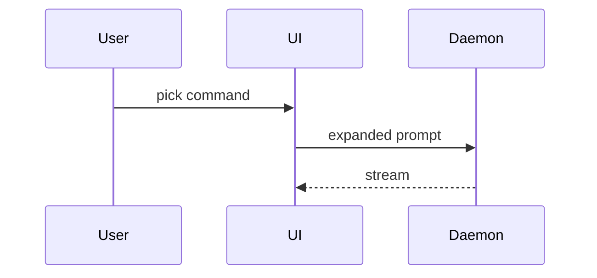

# Sightline

Understand the system before you change it. Then plan only as far as you can
see.

## Where this sits

A feature is not a new thing. It is a change to a system that already exists,
and most of what looks like a design question is an unread one.

So sightline runs before planning, always, and always starts from what is
already there:

```
need ──→ sightline ────────────────────→ plan-with-docs ──→ build
         how it works today, and why     phasing, AC
         where this lands, what moves
         which approach, and what it costs
```

It is **invoked by name**. It does not fire on its own, and it is not a rescue
for a conversation that stalled — by the time a plan feels premature, the
reading it skipped is already load-bearing.

Three failures it exists to prevent:

| The failure | What actually went wrong |
|---|---|
| a technically plausible implementation that ignores how the system works | the agent read the feature, not the system |
| a question nobody can answer gets answered anyway, under pressure — and then reads exactly like a decision in the plan | no one distinguished *unread* from *unknowable* |
| a long, thorough plan the user approved without holding | understanding is not verification, and approval costs nothing |

The third is the one that compounds. A user who can't explain the system can't
participate: can't spot the wrong turn, can't have the next idea, because they
lack the concepts to think with. Optimise for their ability to keep steering.

## The spine

```
need arrives                  input, not a design — it scopes the reading
   ↓
Reconstruct   how the part this touches works today, and why
   ↓          written as you go · gate: they draw it or say it
Fit           where the new thing lands, and what moves
   ↓
Approaches    2–3 whole-change approaches, one pick, what the pick costs
   ↓
Triage        what reading left open — ASK / RESEARCH / PROBE / DEFER
   ↓
Resolve       one row per context
Seams         who writes what by hand
Gate          the user demonstrates they hold each decision
   ↓
Land          horizon check, artifacts, handoff
Re-fog        when the build contradicts something
```

Reconstruct → Fit → Approaches is one pass, in `cookbooks/reconstruct.md`.
Everything after it is per-row.

## What to read next

This file is the spine — invariants, disk layout, the turn loop, how to talk.
The procedures load on demand, because a session works **one thing** and
shouldn't carry the other phases while it does.

| You are | Read |
|---|---|
| starting — a need, nothing on disk | [cookbooks/reconstruct.md](cookbooks/reconstruct.md) |
| resuming — `.sight/` exists | `sight resume`, then whatever its pointer names |
| reading done, rows to classify | [cookbooks/triage.md](cookbooks/triage.md) |
| working one row | [cookbooks/resolve-row.md](cookbooks/resolve-row.md) |
| holding a finding, or out of `now` rows | [cookbooks/land.md](cookbooks/land.md) — horizon check first, then the plan |
| looking at a board, the user drew one, or one is worth offering | [cookbooks/board.md](cookbooks/board.md) — before anything else |
| building, and an assumption just broke | [cookbooks/land.md](cookbooks/land.md) § re-fogging |

Read one. Needing two at once usually means the row is two rows.

### When to offer a board

The user will rarely ask. Offer at these moments — one line, then carry on in
text whether or not they take it:

| Moment | Why |
|---|---|
| a question is about **shape** — what talks to what, ordering, what crosses a boundary — and the text form needs more than ~6 nodes | `A --> B` stops being readable exactly when the arrows start crossing |
| the reconstruction is a flow, and the gate on it | what they owe you *is* a drawing, and a missing arrow names the slice they didn't read |
| they're answering a structural question and stall, or say "hard to explain" | drawing is faster than typing, for them |
| a probe changed the structure | show it as a diff on the board, not as a paragraph about the change |
| the horizon check is structural | the reconstruction they owe you can *be* the board |

Offer, never open. Never wait for them to look, never answer with "see the
board", and never let a board be the only place something is said. The board is
one board per effort — that *is* the general view, so there is no second one to
build.

If they take it, it is live from that moment: what they draw reaches you three
seconds after they stop, and what you add reaches their open tab. Still don't
wait on it — they may draw nothing, and the conversation carries on regardless.

## Commands

The skill picks recipes; it never improvises shell. Each is one node script —
`just` is convenience, not a dependency.

| `sight …` | runs | does |
|---|---|---|
| `resume [effort]` | `node scripts/resume.mjs` | the only thing a fresh context reads |
| `write <path> …` | `node scripts/write.mjs` | the only way an artifact exists — body on stdin, `touched:` stamped here |
| `check [effort]` | `node scripts/check.mjs` | what is unfinished, before the pointer moves or a plan lands |
| `spike` / `spikes` / `burn` | `node scripts/spike.mjs …` | open a quarantined spike, list what's standing, delete one whose finding landed |
| `board <file>` | `node scripts/board-serve.mjs` | Excalidraw on localhost:3777, autosaving, two-way |
| `add '<json>'` | `node scripts/board-add.mjs --json` | append boxes/arrows/frames, bound correctly |
| `box` / `arrow` / `frame` | `node scripts/board-add.mjs …` | one element at a time |
| `ids` | `node scripts/board-add.mjs --list` | what's on the board, mine vs theirs |

```
alias sight='just --justfile <this skill>/justfile --working-directory .'
```

`board` is never run as a plain background command — always under `Monitor`,
`persistent: true`. Its stdout is a change feed, not a log: three seconds after
they stop drawing, one block arrives naming what changed. Serving a board
without watching it makes it one-way, and wastes the thing they drew.

```
you  sight add …  ──→ file ──→ their open tab updates, mid-drag and all
they draw         ──→ file ──→ 3s quiet ──→ "board: 2 changes …" in your chat
```

When a block arrives, mid-row and unloaded cookbook notwithstanding:

| The drawing | You |
|---|---|
| contradicts the reconstruction | say so in one line — the drawing is authoritative for structure |
| contradicts the row you're on | say so in one line — it may end the probe early |
| contradicts a landed finding | reopen that row on the map |
| a `?`, or a scribble you can't read | onto the map, not into this turn |
| anything else | one line of ack |

Never answer a drawing with a redraw. Fuller mechanics:
[cookbooks/board.md](cookbooks/board.md).

## Invariants

1. **Read only what the change needs.** The need scopes the reading, always.
   The check is impact: if you can't name what moves when this lands, you
   haven't read enough. Reading past that is archaeology, and it costs the user
   the session.
2. **Every claim about the system is quoted or it's a guess.** If you can't
   quote the line that says it, it's your inference — mark it as one.
3. **Don't ask the user something they can't know.** When an answer arrives with
   a shrug, a "probably", a restatement of your own suggestion, or an instant
   yes to your recommendation, stop collecting it. Re-put it as a scenario;
   if that still draws a shrug, it's a probe, not an answer — onto the map.
4. **Never plan past the horizon.** The horizon is the first point where
   building will teach you something that changes everything after it. Beyond
   it, write named unknowns, not steps.
5. **Probe code is throwaway and quarantined.** Never write production code
   during a sightline session, and never import production code into a probe.
   A probe answers a question and then dies.
6. **Every resolution produces something the user can disagree with.** A claim
   they can only nod at is not a resolution.
7. **The user's understanding is a gate.** If they can't explain a decision
   back — or the system it rests on — it isn't made yet, however good it is.
8. **The context window is not the store.** Anything that matters is on disk
   before the turn ends. Assume this session dies without warning.

## How to talk during a session

Terse. Show, don't describe. The user does not reason in prose, and a paragraph
explaining a shape is strictly worse than the shape.

| Instead of | Write |
|---|---|
| "the retry policy backs off exponentially" | `1s, 2s, 4s, 8s, give up` |
| a paragraph on the tradeoff | table, two columns, one row per option |
| "consider whether X should own Y" | the two type signatures, pick one |

### Never make them learn your filing system

Row numbers, file paths and the words for your own machinery exist so a cold
context can find things. They mean nothing to the user, and every one you put in
front of them is a lookup you are charging them for.

```
internal   MAP.md · the q/ and findings/ paths · `sight` output · your turns
external   everything they read — and that includes the label and every
           option of a question you put to them
```

| Don't write | Write |
|---|---|
| `row 15` | the question it holds — *"missing option: excluded, or worst-cased?"* |
| `findings/33c` | *"the card layout we settled"* |
| `probes/06-score` | *"the scoring prototype"* |
| `burn 06`, *spike*, *dissolved* | nothing — those are things you do, not things they decide |
| *Invariant 5* | the reason itself, in one clause |

Script output is the mechanism here. `resume`, `check` and `spikes` print row
numbers and paths because **you** are the reader; relaying that text to the user
is how the ids get out. Their vocabulary is correct — don't go and change it.

**Then check the question still exists.** Translate it out of your filing
system, and:

```
nothing left        it was bookkeeping. Do it, report it in one line.
something left      that was always the question. Ask only that.
```

A worked example, because this is the failure it is named for. Two throwaway
prototypes on disk, both findings landed — so the skill already knows they get
deleted. What it asked instead:

```
✗  Two spikes are still on disk with their findings landed: probes/06-score
   (the scorer behind rows 06/17/18/23/24/27) and probes/33-mapa. Burn them?
     1. Keep 33-mapa, burn 06-score
     2. Burn both (Invariant 5 — probes die once the finding lands)
     3. Keep both — costs nothing but disk
```

Nine identifiers, and options 1 and 3 contradict the invariant that option 2
cites. Offering a rule-break as a choice is worse than the jargon: it hands over
a decision the skill had already made, phrased so the user cannot tell. Under
the translation, the bookkeeping evaporates and one real question is left —
a design one:

```
✓  Deleted the throwaway prototypes; their conclusions are in the notes.
   One thing outlives them — the card mockup you approved. Keep it beside
   the design notes as the reference to build against?
```

### Pick the smallest view that carries the point

One form per point. Two if they carry different points. Never all of them.

**A rule, a policy, an algorithm** — pseudocode:

```text
on(save)
  content unchanged → return cached
  write, invalidate cache
```

**What calls what** — call tree:

```text
submitForm
  createSession
    persistPrompt
    launchAgent
  navigate
```

**UI shape** — component tree, carrying only the state and boundaries in
question:

```text
<SessionPage>            routes/session.tsx
  useSessionEvents()
  <Toolbar>
    <RunButton>          packages/ui
```

**Who owns what** — shallow file tree, one clause per dir:

```text
src/
├── commands/   parses user actions
├── sessions/   owns session state
└── transport/  talks to the API
```

**Ordering across processes** — mermaid, when the sequence *is* the point:



**A change to any of the above** — a diff *in that same form*, so the unchanged
lines carry the context:

```diff
 on(save)
-  write content
+  content unchanged → return cached
+  write, invalidate cache
```

This is the text twin of showing a probe's result as a board diff, and it is the
form most turns want: neither a probe nor a new feature usually invents a shape,
it moves one. Show the whole block instead only when most of it is new, when the
omitted context would hide ownership or order, or when they need something
copyable to write against.

Rules:
- Under ~60 words of prose per turn. Longer wants a view, not more sentences.
- Every claim about behaviour gets a concrete instance next to it.
- Each view sits next to the one or two lines it supports — never a wall of
  diagrams, never a diagram with no claim attached.
- Keep only the calls, files, props and boundaries the current question turns
  on. Everything else is noise you are asking them to filter.
- No preamble, no recap of what was just agreed.
- Too dense for text — a layout, a state comparison, a side-by-side of two
  designs — is one focused HTML file with the product's real labels and data,
  then `open` it. Not a second board: when a board is live, structure lives
  there.

Same for what you produce: `current-state.md`, `impact.md`, findings, ADRs, the
plan's `## Decided` lines. Short, exemplified, skimmable — the same forms, on
disk.

## Working outside the context window

Understanding a system outlives a context window by definition — reading takes
turns, probes take turns, and each finding changes what the next question even
is. So the session is not the unit of work. The map is.

**Effort** — one destination, held on one map, taking however many contexts it
takes. It is the thing `.sight/<effort>/` is named for.

```
effort    tenant-isolation        one destination, one MAP.md, one board
  row     "schema or RLS?"        one question, one context, one finding
    probe p99 within 15%?         one timebox, one decision rule
```

Its boundary is the destination — not a ticket, not a sprint, not a session.
Two questions belong to the same effort when resolving one changes what the
other asks. If two maps would never need to reference each other, they're two
efforts.

| Too small | Right | Too big |
|---|---|---|
| one question — that's a row, or just `/probe` | one change you can't yet see the end of | a roadmap — several destinations, so several maps |

Name it for the destination, not the feature: `tenant-isolation`, not `phase-2`.
Phases are your boundaries and they move; the destination is what the user
recognises a year later.

Layout, or the equivalent on whatever tracker the repo uses:

```
.sight/<effort>/
  MAP.md              index only — never a store
  current-state.md    how the touched part works today, and why
  impact.md           where the new thing lands, and what moves
  alternatives.md     approaches weighed, the pick, what the pick costs
  q/<nn>-<slug>.md    one file per open question, self-contained
  findings/<nn>.md    the 4-liner /probe returns, written the moment it ends
  probes/<nn>-<slug>/ excluded spike code, burned once the finding lands
  board.excalidraw    optional, one per effort
```

### What lives where, and for how long

The three reading artifacts are **dated by construction** — they describe the
system *before* this change, so they are stale the moment it lands. A decision
isn't. That difference is the whole filing rule:

| | Where | Lifespan |
|---|---|---|
| decisions, and why | the repo, in the shape it already keeps them — ADRs, glossary | durable |
| `current-state.md`, `impact.md`, `alternatives.md` | `.sight/<effort>/` | dies with the effort, after the handoff reads it |
| open questions | `q/`, and the plan's `## Deferred` / `## Known unknowns` | until they're answered |

There is no third store. Do not add an `open-questions.md`; `q/` is that file,
one row at a time.

The map, the artifacts, the questions and the findings belong in the repo so an
effort survives a laptop. The spike doesn't, and neither its quarantine nor its
death is left to memory — both are recipes:

```
sight spike 07-transit-api "p99 < 40ms over 500 conns → notify; any drop → outbox"
sight spikes            # what's still on disk, and whether its finding landed
sight burn 07           # refuses while findings/07*.md is missing
sight burn --all
```

`spike` writes `RULE.md` and adds `.sight/probes/` and `.sight/*/probes/` to
`.git/info/exclude`, so the effort stays shareable and the spike stays out of
the repo's tracked ignore file. It refuses without a rule, because `/probe`
does. `burn` refuses while the finding is missing, and `resume` names every
spike still standing.

The board adds nothing either: the excalidraw it serves ships with the skill.

**MAP.md** stays under roughly 60 lines whatever the size of the effort, because
every resumed session reads it in full. It holds: the destination, the horizon,
the triage table with a one-line status per row, and a pointer to the current
work. It never restates a finding or a flow — it links. If the map is growing,
you're storing in it.

**Question files** carry everything needed to work that row cold: the question,
why it's open, what the reading already ruled out, the probe plan, the timebox.
A fresh session should be able to open one file and start work without reading
the others. This is what lets the effort be arbitrarily large — the map scales,
the working set doesn't.

### The pointer, and the reading frontier

Two machine-read conventions, because resuming is a script, not a habit. The
pointer names whatever is being worked, and during reconstruction that is an
artifact, not a row:

```
MAP.md
  → current: current-state.md            while reading
  → current: q/07-schema-vs-rls.md       after triage

frontmatter, on every artifact the effort keeps
  touched:  2026-08-21          the day this file's answers were true
  paths:    src/api src/db      what it depends on — and, while reading, what's been read
  unread:   the write path below OrderService     reconstruction only
  requires: single tenant       findings only — what must stay true
```

`paths:` does double duty: it feeds the `MOVED SINCE` git-log, and while reading
it *is* the record of how far you got. `unread:` is the frontier — one line,
plain English, enough that a cold context knows where to pick up.

`requires:` is the other half of decay. `paths:` catches the code moving under a
finding; `requires:` catches the conditions moving under it, which git cannot
see — *single tenant*, *fewer than fifty groups*, *while the job is nightly*.
When one stops being true the finding is dead, however untouched its files are.
`requires: none` is a real answer; leaving it out is not, because a finding with
no stated conditions is one nobody can tell has expired.

### Artifacts are written through one command

Every one of those keys is read by a script later, and every one of them was
missed while they were prose: stamps below the fence where nothing parses them,
findings landing with no `Decides:` line, a date typed a day wrong. So an
artifact is not written by hand:

```
<body on stdin> | sight write findings/07.md --paths src/db --requires "single tenant"
                | sight write current-state.md --paths "src/api" --unread "the write path"
```

It stamps `touched:` itself — a date you pass is a date you can get wrong — and
refuses a body that is not yet the thing it claims to be. Shape only. What it
cannot judge is whether the effort is *finished*, and demanding that at write
would break the write-as-you-go loop, so that lives at the gate:

```
sight check        # every gate, read-only. run it before the pointer moves,
                   # and again before landing a plan
```

`check` names what is unfinished: a frontier still open, a row with no finding,
a spike still standing, an `## Moves` section with nothing under it. It changes
nothing — a checker that edits is a checker nobody believes. And when it comes
back green it says so plainly: the mechanical gates are met, and the gate that
decides is the user explaining the system back, which nothing on disk can show.

### The turn loop

**While reading**, the loop is per slice, not per context:

1. Read a slice, write it into `current-state.md` immediately — not at the end.
2. Rewrite it through `sight write` — that is what updates `paths:` and
   `unread:` and re-stamps `touched:`.
3. Frontier empty → move to Fit.

Never hold a slice in context intending to write it up later. That is the
turn the session dies on.

**Per row**, at the end of every one, before anything else:

1. Land the finding through `sight write findings/<nn>.md --paths … --requires …`
   (`Q / Tried / Found / Decides`), then `sight burn <nn>`.
   In that order — it refuses the other way round.
2. Update that row's status in MAP.md, move `→ current:`, and stamp `touched:`
   on every row you looked at — including ones you left open.
3. **Run the finding past every open DEFER row** — dead, awake, cheap. A row
   this finding answered sideways is closed here or it lies for weeks.
4. Land the ADR or glossary change if the finding earned one.
5. **If the finding moved the structure, offer the board** — one line, then
   carry on. This is the trigger that fires most and gets skipped most: the
   table above is read once at load, and by the time a probe reclassifies a
   thing you are six rows deep and drawing nothing.
6. Tell the user the context is now safe to clear.

Then clear. Carrying a resolved row's detail into the next row costs context and
buys nothing — the finding is the compression.

### ASK rows are batched, never serialized

One row per context is a budget on *context*. It does not apply to questions the
user answers from their head: those cost nothing to carry and no finding changes
them. Serializing them just spends one interruption each.

| Row type | Rhythm |
|---|---|
| ASK | every open one at once, four at a time, each with your recommended answer |
| RESEARCH / PROBE | one per context; pointer moves, the finding compresses |
| DEFER | never blocks and is never worked — but checked three ways whenever something new lands, and *cheap* may ask it |

So **an ASK row never holds `→ current:`** — the pointer is for work, and an ASK
is not work, it's a message. Park the pointer on the next PROBE or RESEARCH row
and carry the ASKs as a pending batch.

If no PROBE or RESEARCH row is open, there is no pointer line and the effort is
blocked on the batch — not at its horizon. Don't land a plan over it.

New ASKs discovered mid-row join that batch. Don't interrupt the row for them,
and don't open a session just to ask one.

#### When they can't judge the options, ask it as a scenario

A recommendation is the cheapest thing in the world to accept, and accepting it
teaches them nothing about why. Two observable triggers:

```
the options differ in ways they have no vocabulary for   → scenario
they stall, or take your recommendation instantly        → scenario
```

Put the choice as two everyday situations with their real consequences, name no
technology until after they pick, then map their pick back to what it costs.
This works the same on a whole-change **approach** as on a single decision's
**options** — worked example and the rules that keep it honest:
[cookbooks/triage.md](cookbooks/triage.md) § scenarios.

```
detect   instant yes, a shrug, a stall
reframe  the same question as a scenario, symmetric, tech unnamed
         they pick and can say what it costs   → the answer stands
         still a shrug                         → PROBE, onto the map
```

This is not the quiz `land.md` rejects. A quiz tests recognition after a
decision exists; a scenario is what makes the decision answerable before it
does. If no everyday situation carries the property the decision turns on, it
was never an ASK — demote it.

### A deferred row is not a parked row

DEFER is the only class with no worker and no moment, which is what makes it
rot: re-read every session, acting only when a human happens to notice. So it
gets a moment. Whenever something new lands — a finding, a new row, a plan step,
a thing the user just said — put the open DEFER rows to three questions:

| | Ask | If yes |
|---|---|---|
| **dead?** | did what we just did already answer this, sideways? | close it, naming the finding that did |
| **awake?** | did its trigger fire? | reopen it, and say so |
| **cheap?** | is the user in this topic *right now*, and can they answer off the top of their head? | ask it now, though nothing is blocked |

Nothing new landed → skip it. Nothing can have changed.

**Dead is the common one.** A row parked as *"which map library"* gets answered
by whoever builds the first thing that draws a map, and the map still says DEFER
weeks later. That is worse than a row that never fires: it reports a hole that
isn't there, and the plan routes around it.

**Cheap is the one that expires.** The answer costs the user nothing while
they're already thinking about it, and costs a re-explanation three weeks after.
Same rule as the ASK batch, for the same reason — that is the cheapest moment
they will ever have to answer. Only for what they answer from their head: a
PROBE or RESEARCH row pulled forward because the topic is nearby is scope creep,
not thrift.

### Resuming

An effort spans days, machines, and any number of contexts. So resuming is one
deterministic command, not a reading habit:

```
node scripts/resume.mjs [effort]
```

It prints MAP.md, whatever the pointer names — the reading in progress or the
current row — what moved in the repo since that file was `touched:`, and one
`Decides:` line per finding. That output is the whole working set. Read nothing
else — not the finished question files, not the old probe dirs. One exception,
and `resume` names it when it applies: a board file is a first-class input, read
before MAP.md. If you need what a closed row concluded, its `Decides:` line is
already in front of you.

Then, before any work: **the repo may have moved under this.** Commits in the
`MOVED SINCE` block invalidate what the reading established — re-check those
first, or you'll probe a question the codebase has already closed. Empty block,
nothing to do.

State in three lines where things stand and what's next, then continue. Do not
re-derive the triage and do not re-ask resolved questions.

(No node? Do it by hand in that exact order, and stop where the script stops.)

If the effort is large enough that even the triage table strains the map, split
it: one map per horizon, and the deferred rows carry forward onto the next map
— carrying their owners, and getting the three checks there like anywhere else.
Waiting for the trigger to fire is what the split must not become. Fog is
layered, so plan in layers.

## Anti-patterns

- Designing against the feature before reading the system. The order is the
  whole skill.
- Reading the whole codebase because the reading felt productive. The need
  scopes it; anything past "what moves" is archaeology.
- Reporting the system as prose. A paragraph about how three modules relate is
  the worst form that answer has.
- Citing without quoting. `[source: auth.ts]` reads identically whether it was
  read or invented.
- Re-running an interview that already happened. It did that better; take its
  leftovers.
- Producing a complete plan on the first pass. Completeness this early is a
  symptom, not an achievement.
- Pressing a PROBE question until the user answers it. That launders a guess
  into a requirement.
- Putting a row number, a file path or a word like *burn* in front of the user.
  They are your filing system, and asking them to learn it is a cost with no
  return. Worse, it hides bookkeeping questions that shouldn't be asked at all.
- Letting a probe become the implementation because it worked, or starting the
  build because the plan is done. The plan is the handoff, not the go-ahead.
- Skipping the understanding gate because the user is in a hurry. The hurry is
  why the gate exists.
- Writing the piece the user reserved for themselves. Fastest is not the job.
- Explaining a decision by restating the code. Background first, then intuition,
  then mechanism.
